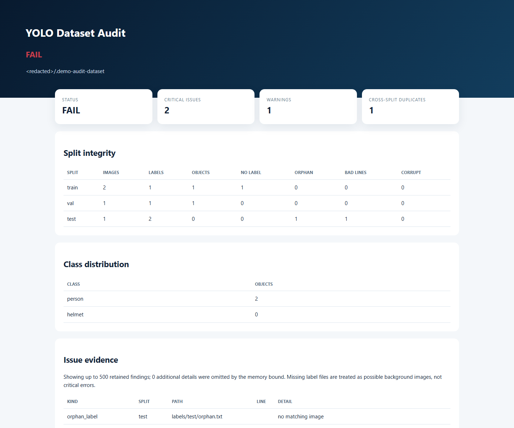
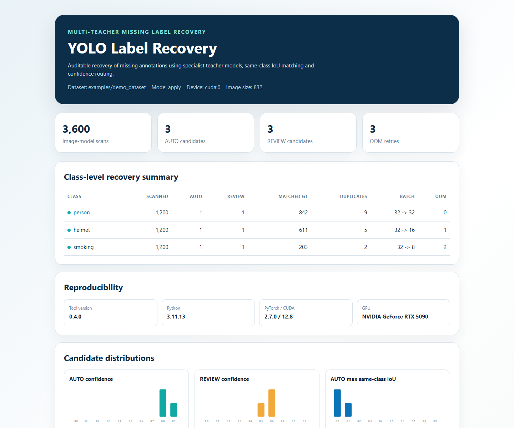
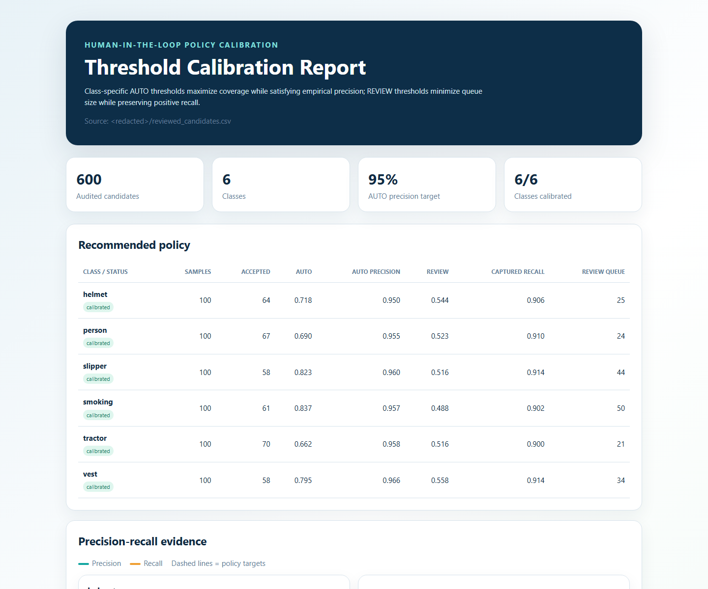
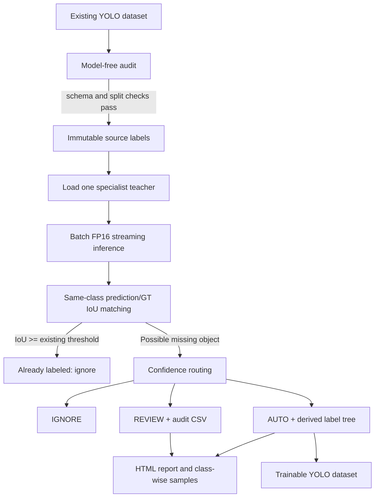

# YOLO Label Recovery

[English](README.md) | [简体中文](README.zh-CN.md)

[](https://github.com/jiapengLi11/yolo-label-recovery/actions/workflows/ci.yml)
[](https://github.com/jiapengLi11/yolo-label-recovery/releases)
[](https://www.python.org/)
[](LICENSE)

A safe, auditable and memory-efficient multi-teacher pipeline for recovering missing annotations in YOLO datasets.

This project was extracted from an industrial safety-vision workflow. It uses one detector per class to scan a multi-class dataset, identifies high-confidence predictions that are not covered by existing labels, and writes additions to a new label tree without modifying the source dataset.

## Pre-generated showcase

No GPU, private dataset or live command is needed to inspect these results. Both screenshots were generated from committed synthetic fixtures. They demonstrate behavior and report structure, not production accuracy.

### Model-free dataset audit



The fixture intentionally contains one invalid class ID, one orphan label and one exact image duplicated across train/val. The audit correctly returns `FAIL`, `2` critical issues, `1` warning and `1` cross-split duplicate group.

### Multi-teacher recovery report



| Evidence | Pre-generated result |
|---|---:|
| Image-model scans | 3,600 |
| Specialist teachers | 3 |
| AUTO / REVIEW examples | 3 / 3 |
| Initial batch | 32 |
| Stable batches | 32 / 16 / 8 |
| Simulated OOM retries | 3 |
| Source labels modified | No |

### Audited threshold calibration



The public fixture contains `600` reviewed candidates across all six classes. With a `95%` empirical AUTO precision target and `90%` captured-positive recall target, all six classes produce supported policies. The resulting AUTO thresholds differ substantially, from `0.662` for tractor to `0.837` for smoking, demonstrating why one global confidence threshold is unsafe.

## Why this project exists

Multi-class datasets often contain combined scenes such as `person + helmet + smoking` or `person + slipper`. If the original annotation process focused on one target at a time, valid objects from other classes can be missing. Training a new multi-class model on incomplete labels can make the model learn the wrong supervision signal.

The workflow is deliberately conservative:



## Main properties

- Original `labels/` are read-only from the tool's point of view.
- Only one detector is kept in GPU memory at a time.
- `stream=True` consumes prediction results incrementally.
- Candidate records are written incrementally to CSV instead of accumulating all predictions in RAM.
- Per-class model class IDs are mapped to the dataset class IDs from `data.yaml`.
- Existing-label IoU and candidate-duplicate IoU are separate controls.
- `--materialize-dataset` creates a standard YOLO dataset using hardlinks when possible.
- Review images are grouped by unique image so multiple candidates from one image remain visible together.
- A model-free audit catches malformed labels, corrupt images and exact train/val/test leakage before GPU work starts.
- Audited candidate decisions can calibrate class-specific AUTO precision and REVIEW recall policies.
- Every scan records a local manifest with parameters, image inventory, package versions, CUDA and GPU metadata.

## One-minute public demo

The demo deliberately creates an invalid class ID, an orphan label and an image duplicated across splits. No model weights or private data are needed.

```powershell
python examples\create_synthetic_dataset.py --output .demo-dataset
yolo-label-recovery audit .demo-dataset `
  --output-dir .demo-audit `
  --hash-images `
  --check-images
```

Open `.demo-audit\dataset_audit.html`. The expected result is `FAIL`: the fixture proves that the audit catches the injected defects.

Inspect an unfamiliar training machine before an expensive scan:

```powershell
yolo-label-recovery doctor --output environment.json --redact-paths
```

## Quick start

Install only the lightweight audit/report tools (no PyTorch or Ultralytics download):

```powershell
python -m venv .venv
.\.venv\Scripts\Activate.ps1
python -m pip install -e .

yolo-label-recovery audit D:\data\mining-safety --output-dir D:\data\audit-001 --hash-images --check-images
```

Calibrate thresholds from a human-reviewed candidate CSV without any GPU dependency:

```powershell
yolo-label-recovery calibrate reviewed_candidates.csv `
  --output-dir calibration `
  --target-auto-precision 0.95 `
  --target-review-recall 0.90 `
  --min-auto-samples 20 `
  --redact-paths
```

For GPU-assisted label recovery, first install the CUDA-compatible PyTorch build required by the target GPU, then install the inference extra:

```powershell
python -m pip install -e ".[inference]"

yolo-label-recovery run `
  --dataset-root D:\data\mining-safety `
  --out-root D:\data\autolabel_run_001 `
  --models-json configs\models.example.json `
  --classes person helmet vest tractor slipper smoking `
  --splits train val test `
  --imgsz 832 `
  --batch 32 `
  --device 0 `
  --workers 0 `
  --draw-review `
  --draw-auto-samples 80 `
  --adaptive-batch `
  --dry-run `
  --force
```

Use `--dry-run` first. It generates statistics, CSV candidates and review images but does not write automatic additions. After checking the output, remove `--dry-run` and add `--materialize-dataset` if a trainable dataset is required.

Generate the visual quality report after a run:

```powershell
yolo-label-recovery report D:\data\autolabel_run_001
```

Add `--redact-paths` when generating a report for GitHub or an interview portfolio. Real run manifests intentionally retain local dataset/model paths for reproducibility and should not be published without review.

Resume an interrupted long-running scan with the original arguments, replacing `--force` with `--resume`:

```powershell
yolo-label-recovery run <same arguments> --resume
```

The checkpoint stores the committed image cursor and statistics after every successful batch. Candidate CSV and label writes are idempotent, so an interrupted batch can be retried without duplicating rows or labels.

## Expected dataset format

```text
dataset-root/
  data.yaml
  images/
    train/
    val/
    test/
  labels/
    train/
    val/
    test/
```

`data.yaml` must define `names` in the same order as the label class IDs. The tool validates the class names before scanning.

## Output format

```text
out-root/
  labels_autofill_v1/       # original labels plus AUTO additions
  candidates_auto.csv       # high-confidence candidates
  candidates_review.csv     # medium-confidence candidates
  candidates_all.csv        # complete candidate audit stream
  auto_samples/<class>/     # sampled AUTO images
  review_images/<class>/    # sampled REVIEW images
  summary.json
  summary.txt
  state.json                # atomic resume checkpoint
  manifest.json             # arguments, inventory, packages, CUDA and GPU
  report.html               # generated quality report
  trainable_dataset/        # optional, created by --materialize-dataset
    data.yaml
    images/
    labels/
```

The source label tree is never used as an output path. Delete the output directory to discard an experiment and rerun from the untouched source dataset.

## Default thresholds

| Class | AUTO | REVIEW |
|---|---:|---:|
| person | 0.75 | 0.55 |
| helmet | 0.75 | 0.55 |
| vest | 0.75 | 0.55 |
| tractor | 0.70 | 0.50 |
| slipper | 0.65 | 0.45 |
| smoking | 0.65 | 0.40 |

Override a class with `--threshold smoking:0.70:0.45`. The format is `class:auto_threshold:review_threshold`.

## Resource model

For `N` images and `K` single-class models, the compute work is approximately `K x N` image-model inferences. The implementation does not load all images or all models at once:

- GPU: current model, current batch activations, current prediction tensors.
- CPU RAM: image paths, current batch decode objects, current-class label cache, bounded review samples.
- Disk: streamed CSV rows and the output label copy.

With `--adaptive-batch`, the tool reports the failing class, split and batch size, discards the uncommitted current batch, and retries it at half the batch size. The current batch is committed to CSV and labels only after successful candidate generation. The summary and HTML report show initial/stable batch sizes and OOM retry counts.

## Project status

This repository is a cleaned engineering artifact, not a released benchmark. Real project images, annotation files, model weights, logs and machine-specific paths are intentionally excluded. Reproducible evaluation requires a user-provided YOLO dataset and single-class weights.

See:

- [Architecture and workflow](docs/ARCHITECTURE.md)
- [Memory and GPU design](docs/MEMORY_AND_GPU.md)
- [Data governance](docs/DATA_GOVERNANCE.md)
- [Threshold calibration](docs/CALIBRATION.md)
- [Threshold calibration (Simplified Chinese)](docs/CALIBRATION.zh-CN.md)
- [Interview presentation](docs/INTERVIEW_STORY.md)
- [Portfolio and interview guide](docs/PORTFOLIO_GUIDE.md)
- [Portfolio and interview guide (Simplified Chinese)](docs/PORTFOLIO_GUIDE.zh-CN.md)
- [Detection model card template](docs/MODEL_CARD_TEMPLATE.md)
- [Architecture decisions](docs/adr/0001-immutable-derived-labels.md)
- [Roadmap](docs/ROADMAP.md)
- [Contributing](CONTRIBUTING.md)

## Verification

The repository includes dependency-light smoke tests that do not require pytest:

```powershell
python -m py_compile autolabel_with_single_class_models.py
python tests\run_smoke_tests.py
pytest
```

For a complete development environment, use `python -m pip install -e ".[inference,dev]"`.
