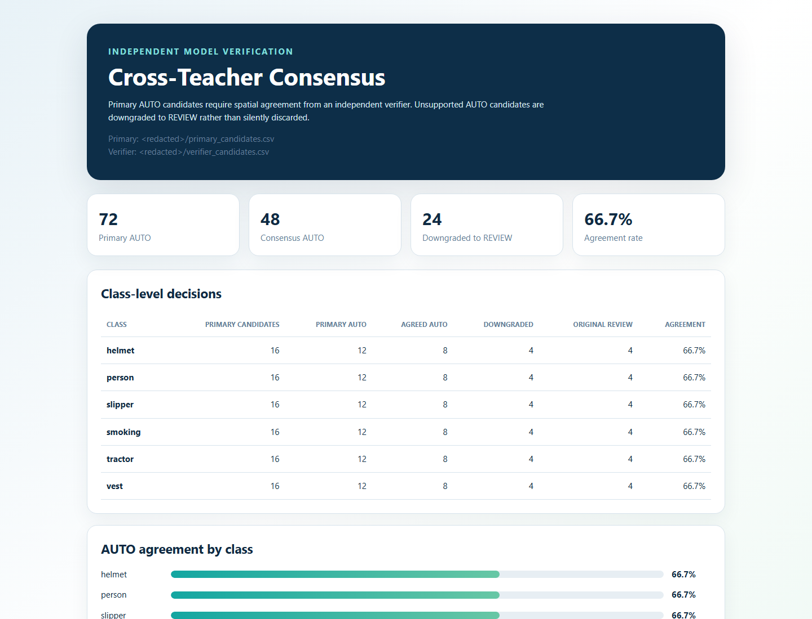
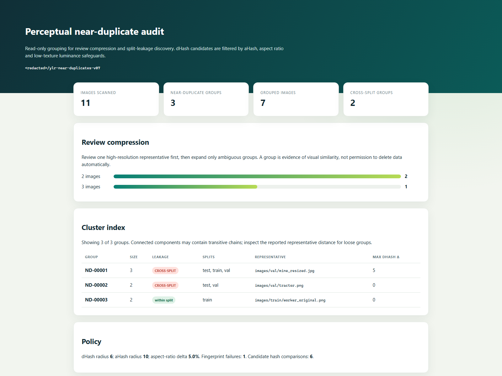
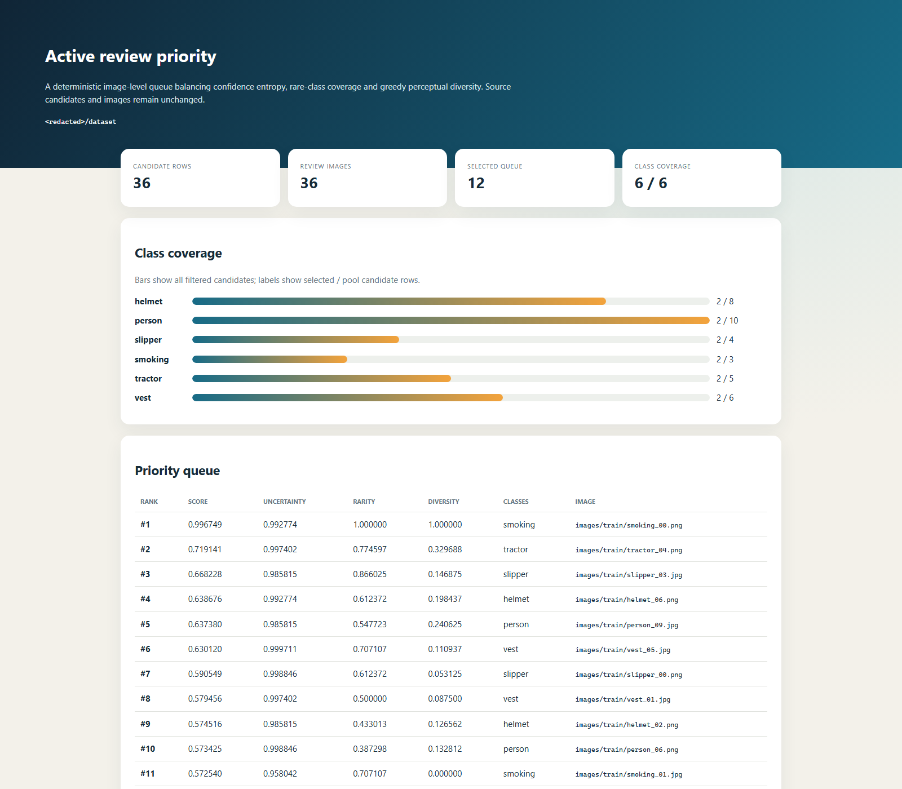
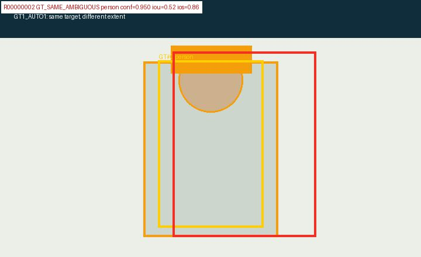
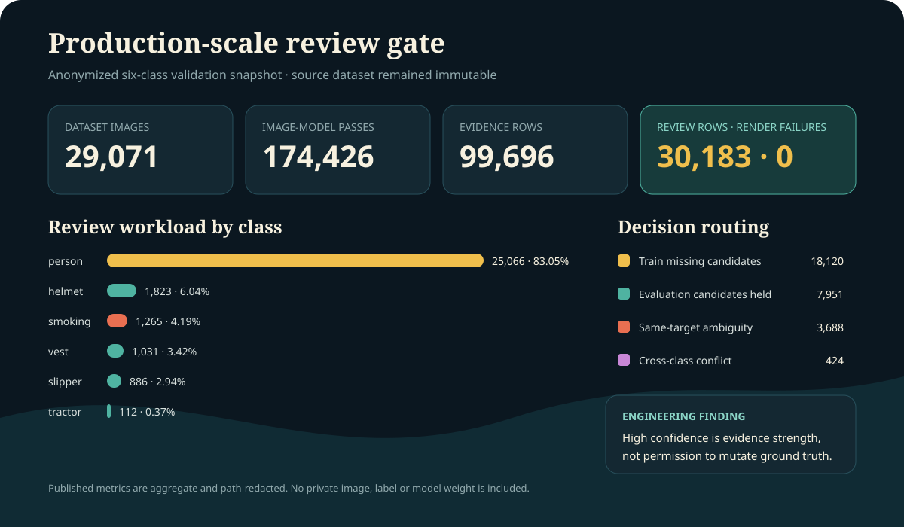
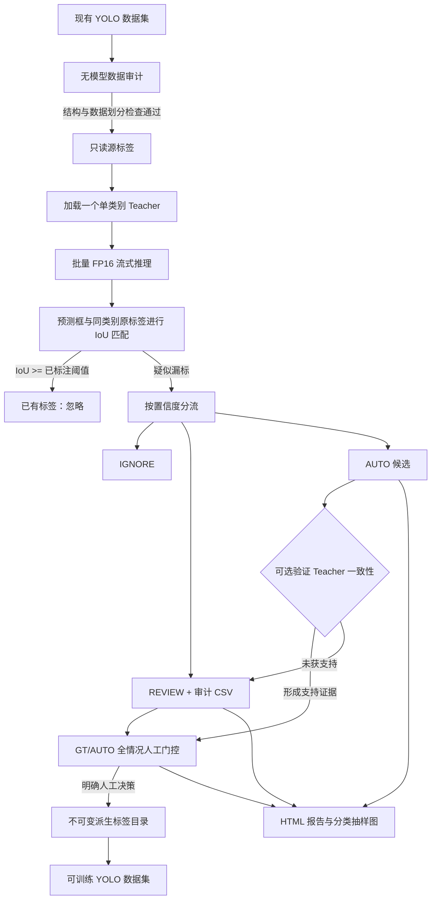

# YOLO Label Recovery

[English](README.md) | [简体中文](README.zh-CN.md)

[](https://github.com/jiapengLi11/yolo-label-recovery/actions/workflows/ci.yml)
[](https://github.com/jiapengLi11/yolo-label-recovery/releases)
[](https://www.python.org/)
[](LICENSE)

一个安全、可审计、内存友好的多 Teacher YOLO 数据集漏标恢复流水线。

本项目源自工业安全视觉任务。它使用每个类别各自的单类别检测器扫描多类别数据集，发现未被现有标签覆盖的高置信度预测，并将新增标注写入派生标签目录，始终不修改源数据集。

## 预生成展示结果

查看以下结果不需要 GPU、私有数据集或现场执行命令。以下截图均由仓库内的合成测试数据生成，用于展示工具行为和报告结构，不代表生产数据精度。

### 无模型数据集审计


合成数据主动注入了一个非法类别 ID、一个孤立标签，以及一组跨 train/val 的精确重复图片。审计结果正确返回 `FAIL`、`2` 个严重问题、`1` 个警告和 `1` 组跨划分重复。

### 多 Teacher 漏标恢复报告


| 展示证据 | 预生成结果 |
|---|---:|
| 图片-模型扫描次数 | 3,600 |
| 单类别 Teacher 数量 | 3 |
| AUTO / REVIEW 示例 | 3 / 3 |
| 初始 batch | 32 |
| 各模型稳定 batch | 32 / 16 / 8 |
| 模拟 OOM 重试次数 | 3 |
| 是否修改源标签 | 否 |

### 审核驱动的阈值校准


公开样本包含六个类别共 `2,400` 条人工审核候选。AUTO 要求精度的 `95%` Wilson 置信下限达到 `95%`，REVIEW 则保留 `90%` 的审核正样本；六个类别均得到统计证据支持的策略。AUTO 阈值从拖拉机的 `0.732` 到吸烟的 `0.859` 差异明显，直观证明全类别共用一个置信度阈值并不安全。

### 跨 Teacher 一致性门控



公开样本包含六类共 `96` 个主 Teacher 候选。在 `72` 个主 AUTO 中，`48` 个得到独立验证 Teacher 的一对一空间支持并保留为 AUTO，另外 `24` 个安全降级到 REVIEW。该阶段不依赖模型推理，不会增加显存压力。

### 感知近重复审核分组



公开样例能够聚合缩放、JPEG 重压缩和亮度变化图片，同时不会错误合并纯黑与纯白低纹理帧。结果包含 `3` 组、共 `7` 张图片，只需优先审核 `3` 张代表图，并发现 `2` 组跨数据划分近重复。

### 多样性感知主动审核队列



公开样例包含 `36` 张类别不均衡的 REVIEW 图片。预算为 `12` 时覆盖全部 `6` 类，前六个位置每类各占一个。动态稀缺度避免小类被忽略，感知多样性则抑制重复连续帧。

### GT/AUTO 全情况人工审核门控



无 GPU 合成样例枚举 `GT0_AUTO0`、`GT1_AUTO0`、`GT0_AUTO1`、`GT1_AUTO1` 四种图片/类别状态，并联合 IoU、IoS、归一化中心距离和面积倍率，区分已标注目标、同目标框尺度不一致、不同漏标目标和跨类别冲突。高置信度仍然只是证据，不代表拥有写标签的权限。

### 生产规模验证



该人工门控还在一个包含 `29,071` 张图片的私有六分类数据集上完成全量验证。六个单类别 Teacher 共执行 `174,426` 次图片-模型推理，形成 `99,696` 条预测证据和 `30,183` 条审核项，可视化失败为 `0`，且源标签保持不变。详见[脱敏案例](docs/PRODUCTION_VALIDATION.zh-CN.md)。

## 为什么需要这个项目

多类别数据集经常包含 `person + helmet + smoking`、`person + slipper` 等联合场景。如果原始标注工作每次只关注一个目标，图中其他类别的有效目标就可能漏标。使用不完整标签训练多类别模型时，这些目标会被当作背景，从而向模型传递错误监督信号。

本工作流采用保守策略：



## 核心特性

- 工具将原始 `labels/` 视为只读数据。
- 显存中同一时间只保留一个检测模型。
- 使用 `stream=True` 增量消费推理结果。
- 候选记录持续写入 CSV，不在内存中累计全部预测。
- 单类别模型的类别 ID 会映射到 `data.yaml` 中的多类别 ID。
- 已有标签匹配 IoU 与候选框去重 IoU 分开控制。
- `--materialize-dataset` 可生成标准 YOLO 数据集，并在条件允许时使用硬链接。
- 复核图按原图聚合，同一张图中的多个候选目标会一起展示。
- GPU 推理前先进行无模型审计，检查错误标签、损坏图片和 train/val/test 精确重复。
- 使用人工审核候选校准分类别策略：AUTO 采用 Wilson 精度置信下限，REVIEW 采用正样本召回约束。
- 使用独立 Teacher 候选流进行一对一空间一致性门控，无需同时加载两个模型。
- 使用感知哈希、BK-tree 和保守视觉约束压缩重复审核工作，并发现跨划分近重复泄漏。
- 图片级主动审核联合置信度熵、动态衰减类别稀缺度和贪心感知多样性。
- 完整 GT/AUTO 枚举避免只看候选框的报告遗漏无预测状态。
- 离线审核要求明确选择新增、替换、评测标签或拒绝，并自动保存审核进度。
- 安全写回会阻止未完成决策、检测源 GT 漂移、再次查重，并创建不可变的派生数据集。
- 每次扫描生成 manifest，记录参数、图片清单、依赖版本、CUDA 和 GPU 信息。

## 一分钟公开演示

演示脚本会故意生成非法类别 ID、孤立标签，以及跨数据划分重复图片。它不需要模型权重或私有数据。

```powershell
python examples\create_synthetic_dataset.py --output .demo-dataset
yolo-label-recovery audit .demo-dataset `
  --output-dir .demo-audit `
  --hash-images `
  --check-images
```

打开 `.demo-audit\dataset_audit.html`。预期结果为 `FAIL`，说明审计工具成功捕获了演示数据中主动注入的问题。

在昂贵的全量扫描前检查陌生训练机环境：

```powershell
yolo-label-recovery doctor --output environment.json --redact-paths
```

## 快速开始

只安装轻量数据审计与报告功能，不下载 PyTorch 或 Ultralytics：

```powershell
python -m venv .venv
.\.venv\Scripts\Activate.ps1
python -m pip install -e .

yolo-label-recovery audit D:\data\mining-safety --output-dir D:\data\audit-001 --hash-images --check-images
```

无需 GPU，即可根据人工审核候选 CSV 校准阈值：

```powershell
yolo-label-recovery calibrate reviewed_candidates.csv `
  --output-dir calibration `
  --target-auto-precision 0.95 `
  --auto-confidence-level 0.95 `
  --target-review-recall 0.90 `
  --min-auto-samples 20 `
  --redact-paths
```

无需 GPU，即可使用独立验证 Teacher 对主 AUTO 候选进行门控：

```powershell
yolo-label-recovery consensus primary_candidates.csv verifier_candidates.csv `
  --output-dir consensus `
  --agreement-iou 0.50 `
  --verifier-min-confidence 0.50 `
  --redact-paths
```

无需模型且不修改源数据，即可聚类感知近重复图片：

```powershell
yolo-label-recovery cluster D:\data\mining-safety `
  --output-dir D:\data\near-duplicate-audit `
  --workers 4 `
  --max-distance 6 `
  --redact-paths
```

生成有限预算、多样性感知的人工审核队列：

```powershell
yolo-label-recovery prioritize D:\runs\candidates_review.csv D:\data\mining-safety `
  --output-dir D:\runs\priority-review `
  --budget 500 `
  --redact-paths
```

根据 Teacher 候选证据生成完整离线审核包：

```powershell
python examples\create_review_fixture.py --output-dir .demo-review-fixture
yolo-label-recovery review-build .demo-review-fixture\dataset .demo-review-fixture\candidates.csv `
  --output-dir .demo-review-result `
  --render `
  --redact-paths
```

全部候选完成人工决策后，创建一个独立的审核后数据集：

```powershell
yolo-label-recovery review-apply D:\data\mining-safety D:\runs\company-review\company_decisions.csv `
  --output-root D:\data\mining-safety-reviewed
```

如需使用 GPU 自动补标，请先安装与目标 GPU/CUDA 兼容的 PyTorch，再安装推理依赖：

```powershell
python -m pip install -e ".[inference]"

yolo-label-recovery run `
  --dataset-root D:\data\mining-safety `
  --out-root D:\data\autolabel_run_001 `
  --models-json configs\models.example.json `
  --classes person helmet vest tractor slipper smoking `
  --splits train val test `
  --imgsz 832 `
  --batch 32 `
  --device 0 `
  --workers 0 `
  --draw-review `
  --draw-auto-samples 80 `
  --adaptive-batch `
  --dry-run `
  --force
```

建议始终先使用 `--dry-run`。它会生成统计信息、候选 CSV 和复核图，但不会写入自动新增标签。检查结果后，移除 `--dry-run`；如需生成可直接训练的数据集，再增加 `--materialize-dataset`。

运行完成后生成可视化质量报告：

```powershell
yolo-label-recovery report D:\data\autolabel_run_001
```

向 GitHub 或面试作品集发布报告时应增加 `--redact-paths`。真实运行的 manifest 为了复现会保留本地数据集和模型路径，未经检查不应直接公开。

长时间扫描意外中断后，可以使用完全相同的原始参数，将 `--force` 替换为 `--resume`：

```powershell
yolo-label-recovery run <相同参数> --resume
```

每个批次成功后，检查点会保存已提交的图片游标和统计信息。候选 CSV 与标签写入均具有幂等性，因此中断批次可以安全重试，不会产生重复记录或标签。

## 数据集格式

```text
dataset-root/
  data.yaml
  images/
    train/
    val/
    test/
  labels/
    train/
    val/
    test/
```

`data.yaml` 必须按照标签类别 ID 的顺序定义 `names`。扫描前工具会校验类别名称。

## 输出格式

```text
out-root/
  labels_autofill_v1/       # 原标签加 AUTO 新增标签
  candidates_auto.csv       # 高置信度候选
  candidates_review.csv     # 中等置信度候选
  candidates_all.csv        # 完整候选审计流
  auto_samples/<class>/     # AUTO 分类抽样图
  review_images/<class>/    # REVIEW 分类抽样图
  summary.json
  summary.txt
  state.json                # 原子化断点续跑状态
  manifest.json             # 参数、数据清单、依赖、CUDA 与 GPU
  report.html               # 可视化质量报告
  trainable_dataset/        # 可选，由 --materialize-dataset 生成
    data.yaml
    images/
    labels/
```

源标签目录绝不会被用作输出目录。如需撤销一次实验，只需删除输出目录，然后从未被修改的源数据重新运行。

## 默认阈值

| 类别 | AUTO | REVIEW |
|---|---:|---:|
| person | 0.75 | 0.55 |
| helmet | 0.75 | 0.55 |
| vest | 0.75 | 0.55 |
| tractor | 0.70 | 0.50 |
| slipper | 0.65 | 0.45 |
| smoking | 0.65 | 0.40 |

使用 `--threshold smoking:0.70:0.45` 覆盖单个类别，格式为 `类别:AUTO阈值:REVIEW阈值`。

## 资源模型

对于 `N` 张图片和 `K` 个单类别模型，计算量约为 `K x N` 次图片-模型推理。实现不会一次加载所有图片或所有模型：

- GPU 显存：当前模型、当前批次激活值、当前预测张量。
- CPU 内存：图片路径、当前批次解码对象、当前类别标签缓存、有限数量的复核样本。
- 磁盘：流式 CSV 记录和派生标签副本。

启用 `--adaptive-batch` 后，工具会记录发生 OOM 的类别、数据划分和批大小，丢弃尚未提交的当前批次，然后将批大小减半重试。只有成功生成候选后，当前批次才会提交到 CSV 和标签目录。汇总文件与 HTML 报告会显示初始/稳定批大小以及 OOM 重试次数。

## 项目状态

该仓库是经过清理的工程作品，不是公开基准测试。真实项目图片、标注、模型权重、日志和机器路径均被有意排除。可复现实验需要用户自行提供 YOLO 数据集和单类别模型权重。

延伸阅读：

- [架构与工作流](docs/ARCHITECTURE.md)
- [内存与显存设计](docs/MEMORY_AND_GPU.md)
- [数据治理](docs/DATA_GOVERNANCE.md)
- [阈值校准（中文）](docs/CALIBRATION.zh-CN.md)
- [阈值校准（英文）](docs/CALIBRATION.md)
- [跨 Teacher 一致性门控（中文）](docs/CONSENSUS.zh-CN.md)
- [跨 Teacher 一致性门控（英文）](docs/CONSENSUS.md)
- [感知近重复聚类（中文）](docs/NEAR_DUPLICATES.zh-CN.md)
- [感知近重复聚类（英文）](docs/NEAR_DUPLICATES.md)
- [主动审核优先级（中文）](docs/ACTIVE_REVIEW.zh-CN.md)
- [主动审核优先级（英文）](docs/ACTIVE_REVIEW.md)
- [GT/AUTO 全情况人工审核（中文）](docs/HUMAN_REVIEW.zh-CN.md)
- [GT/AUTO 全情况人工审核（英文）](docs/HUMAN_REVIEW.md)
- [生产规模验证（中文）](docs/PRODUCTION_VALIDATION.zh-CN.md)
- [生产规模验证（英文）](docs/PRODUCTION_VALIDATION.md)
- [面试项目讲解](docs/INTERVIEW_STORY.md)
- [作品集与面试指南（中文）](docs/PORTFOLIO_GUIDE.zh-CN.md)
- [作品集与面试指南（英文）](docs/PORTFOLIO_GUIDE.md)
- [检测模型卡模板](docs/MODEL_CARD_TEMPLATE.md)
- [架构决策记录](docs/adr/0001-immutable-derived-labels.md)
- [路线图](docs/ROADMAP.md)
- [贡献指南](CONTRIBUTING.md)

## 验证

仓库包含不依赖 pytest 的轻量冒烟测试：

```powershell
python -m py_compile autolabel_with_single_class_models.py
python tests\run_smoke_tests.py
pytest
```

完整开发环境可使用 `python -m pip install -e ".[inference,dev]"` 安装。
