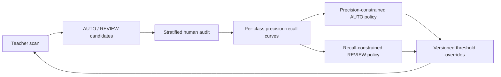

# Architecture

## Problem definition

The tool addresses incomplete labels in multi-class YOLO datasets. A single multi-class detector is not used as the only source of truth because a missing label can become a weak learning signal. Instead, specialist single-class detectors provide independent evidence for each class.

## Processing stages

0. Optionally run the model-free audit for schema errors, corrupt images and exact cross-split leakage.
1. Validate the dataset structure, `data.yaml`, selected classes and model paths.
2. Build a path index for `train`, `val` and `test` once.
3. Copy the original label tree to `labels_autofill_v1` only in apply mode.
4. Load one class model and one class label cache.
5. Infer the split in batches with `stream=True`.
6. Move the small prediction representation to CPU and compare against same-class GT boxes.
7. Discard matched predictions, duplicate candidates and low-confidence predictions.
8. Stream candidates to CSV and keep bounded image samples for review.
9. Append AUTO labels only to the output copy after the current batch is processed.
10. Flush audit files and atomically advance `state.json` after the batch commit.
11. Release results, model, label cache and CUDA cache before the next class.
12. Generate `report.html` from the summary, CSV audit trail and bounded sample images.

Each recovery run also writes `manifest.json` at startup. It captures the immutable run signature, arguments, image/model inventory, package versions, CUDA details and GPU properties. A completed run adds result totals and per-class statistics. If the process crashes, the manifest remains in `running` state and `state.json` identifies the last committed batch.

## Why single-class teachers

The specialist models make the source of a candidate explicit. A `helmet` prediction is compared only with existing `helmet` labels; it is not considered covered merely because a `person` box overlaps it. This is useful for combined scenes where multiple classes occupy the same region.

## Two IoU questions

The implementation keeps two IoU thresholds separate:

- `iou_existing`: prediction versus original same-class GT. Default `0.50`.
- `iou_candidate_duplicate`: candidate versus candidate after model NMS. Default `0.95`.

The first asks whether an object was already annotated. The second asks whether two predictions are almost the same box. Reusing one threshold for both questions can erase nearby real objects.

## Dry-run and apply

Dry-run and apply share the same candidate generation logic. Apply adds two side effects: a copied label tree with AUTO additions and, optionally, a materialized YOLO dataset. This makes dry-run the recommended audit gate before training.

## Resume semantics

The checkpoint cursor advances only after CSV rows and labels are committed. Writes are idempotent: candidate identity prevents duplicate CSV records and normalized label lines are checked before appending. If a process stops between a data write and checkpoint update, `--resume` safely retries the same batch.

The state signature covers dataset metadata, teacher files, classes, splits, thresholds and matching parameters. A resume attempt with different inputs is rejected instead of silently mixing experiments.

## Audited policy feedback loop

Threshold calibration turns the recovery pipeline into an iterative data-quality system rather than a one-off inference script.

The calibration sample is evidence for the routing policy, not a replacement for an independent model test set. A policy should be recalibrated when the Teacher model, target camera domain, operating conditions or annotation rules change.
