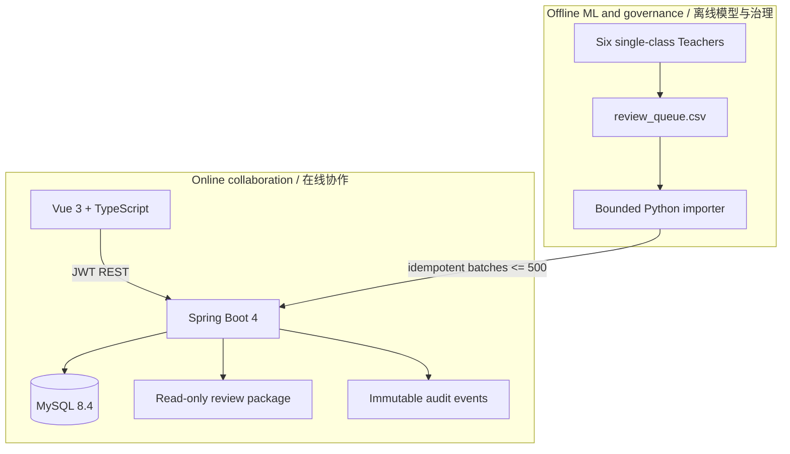
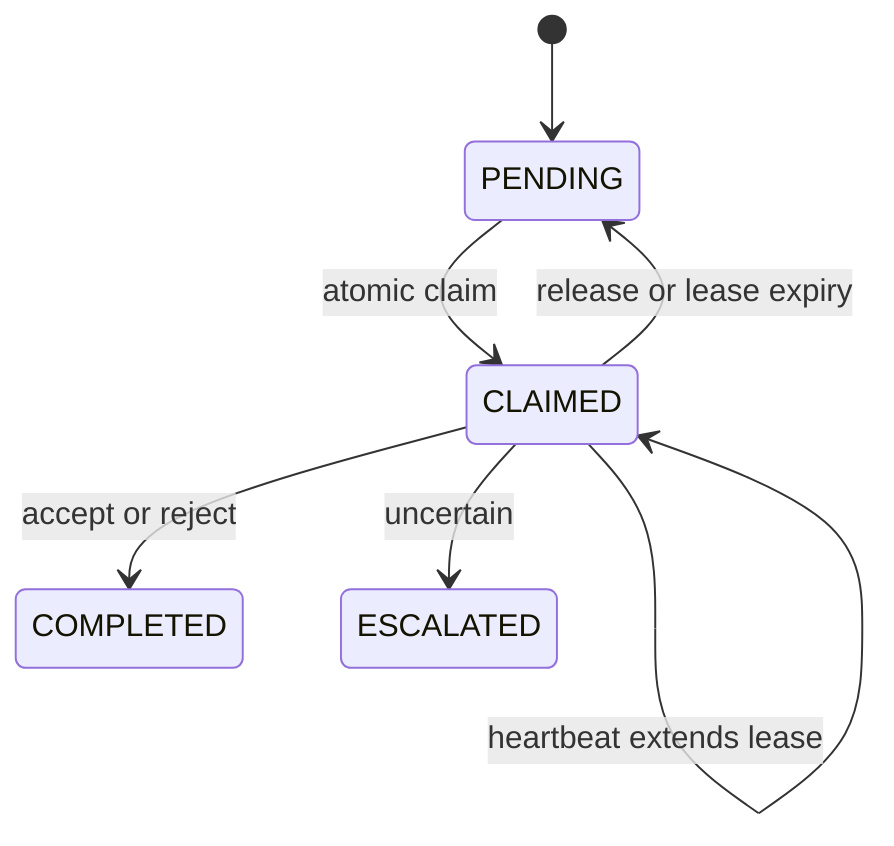

# Multi-user Review Collaboration Platform / 多人审核协作平台

## 1. Why this layer exists / 为什么增加这一层

The original Tk reviewer remains the best zero-dependency choice for one reviewer or offline delivery. A team workflow introduces different failure modes: two people may receive the same candidate, a browser may submit a stale decision, reviewers may see another project's data, and a final CSV may not explain who made each choice. The collaboration layer solves those coordination problems without replacing the Python inference and data-governance pipeline.

原有 Tk 审核器仍适合单人、离线和拷贝即用场景。多人并行后会新增四类风险：重复领取、旧页面覆盖、跨项目越权和责任不可追溯。Web 协作层只负责账号、任务与决策，不取代 Python 推理、GT/AUTO 枚举和最终派生数据集生成。

## 2. Architecture / 架构



| Layer | Technology | Responsibility |
|---|---|---|
| ML and queue | Python 3.10+ | Teacher inference, GT/AUTO reasoning, visual rendering, CSV export |
| Web client | Vue 3, TypeScript, Vite | Login, project progress, real-image review, heartbeat, constrained decisions |
| API | Java 21, Spring Boot 4, Spring Security | Authentication, authorization, leasing, decisions, audit and visual access |
| Persistence | MySQL 8.4, JPA, Flyway | Users, projects, memberships, tasks, decisions, schema migrations |
| Delivery | Docker Compose, Nginx | One-command three-service deployment and same-origin API proxy |

## 3. Authorization model / 权限模型

Authentication and authorization are separate.

1. The password is stored with Spring Security's adaptive `DelegatingPasswordEncoder`; the API never stores plaintext passwords.
2. Login issues a short-lived HMAC-SHA256 JWT containing user ID, display name and role.
3. Global RBAC controls capability: `ADMIN` manages users/projects, `REVIEWER` decides tasks, and `AUDITOR` reads progress/audit.
4. Project membership controls scope. A non-admin sees, claims and opens visuals only for assigned projects.
5. The visual endpoint normalizes the requested path and rejects path traversal outside the configured read-only review root.

权限采用两层模型：角色决定“能做什么”，项目成员关系决定“能在哪个项目做”。即使知道任务 ID，未加入项目的账号也无法读取审核图。

## 4. Concurrency and correctness / 并发与正确性

### Atomic claim / 原子领取

`claim-next` runs in one database transaction. The repository uses `PESSIMISTIC_WRITE` (`SELECT ... FOR UPDATE`) to lock the first pending or expired task. A concurrent reviewer must wait and then receives a different row or `204 No Content`.

### Renewable lease / 可续租任务

A claim is not permanent. It records `claimed_by` and `lease_until`; the browser sends a heartbeat every 60 seconds. Closing the browser stops renewal, so the task becomes claimable after the configured lease period. A reviewer must release or finish the active task before switching projects.

### Optimistic version / 乐观版本

Every task carries JPA `@Version`. The client submits `expectedVersion` with a decision. If another transaction changed the task, the API returns `409 Conflict` instead of silently overwriting newer state.

### Idempotent import and one decision / 幂等导入与唯一决定

`(project_id, candidate_id)` is unique, so importing the same queue again safely skips existing candidates. `review_decisions.task_id` is also unique, so one task cannot obtain two final decisions even if a client retries.

## 5. State and data model / 状态与数据模型



Core tables are `app_users`, `review_projects`, `project_members`, `review_tasks`, `review_decisions` and `audit_events`. Flyway owns schema evolution; Hibernate validates rather than mutates the production schema.

## 6. Run with Docker Compose / Docker 一键运行

```powershell
cd platform
Copy-Item .env.example .env
```

Edit `.env` and set strong database/admin passwords, a random JWT secret, and the absolute host path of the review package. Generate a JWT key with `openssl rand -base64 32` or an equivalent cryptographic random generator.

```powershell
docker compose up -d --build
```

Open `http://localhost:8088`. The bootstrap admin is created only when the configured username does not already exist.

## 7. Import an existing queue / 导入现有审核队列

The queue must contain `candidate_id`, `split`, `image_name`, `class_name`, `conf`, `case_code`, `recommended_action` and `visual_file`. `visual_file` must be relative to the mounted review package root.

```powershell
python platform\tools\import_review_queue.py `
  D:\review_package\review_queue.csv `
  --base-url http://localhost:8088 `
  --username admin `
  --password "your-admin-password" `
  --project-name "2026-08 six-class review" `
  --review-root /review-data
```

The importer reads one CSV row at a time and uploads at most 500 rows per request. It does not load the full queue or all images into memory. Re-running the same command is safe because candidate IDs are idempotent.

After creating reviewer accounts in the admin drawer, assign each username to the selected project. Reviewers then see only their assigned projects.

## 8. Local development / 本地开发

```powershell
# Backend
cd platform\backend
mvn test
mvn spring-boot:run

# Frontend, in another terminal
cd platform\frontend
npm install
npm run dev
```

The Vite development server proxies `/api` to `localhost:8080`. Tests use H2 in MySQL compatibility mode; production uses MySQL and Flyway.

## 9. API surface / 主要接口

| Method | Path | Meaning |
|---|---|---|
| POST | `/api/auth/login` | Authenticate and issue JWT |
| GET | `/api/projects` | List visible projects |
| POST | `/api/projects/{id}/members` | Assign a project member, admin only |
| POST | `/api/projects/{id}/tasks:batch` | Idempotent task import, admin only |
| POST | `/api/tasks/claim-next?projectId={id}` | Atomically lease one task |
| POST | `/api/tasks/{id}/heartbeat` | Renew current user's lease |
| POST | `/api/tasks/{id}/decision` | Submit constrained decision and expected version |
| GET | `/api/tasks/{id}/visual` | Read an authorized real review image |
| GET | `/api/projects/{id}/audit` | Read project audit trail, admin/auditor |

## 10. Interview walkthrough / 面试讲解顺序

1. Start from the data problem: incomplete labels make true objects become false background supervision.
2. Explain why offline inference and online review are separated: GPU jobs are expensive and bursty; human review is concurrent and stateful.
3. Draw the claim transaction and lease timeline; emphasize pessimistic locking for allocation and optimistic locking for stale clients.
4. Explain dual authorization: RBAC handles capability while project membership handles data scope.
5. Show bounded idempotent import and read-only visual mounts as memory-safety and data-safety decisions.
6. Close with evidence: production queue scale, real grouped images, automated Java/Python tests and reproducible Docker deployment.

## 11. Production hardening / 生产加固

Before exposing the service beyond a trusted LAN, terminate TLS at a reverse proxy, rotate JWT/database secrets, disable bootstrap admin after first setup, back up MySQL, centralize logs and metrics, and define account disable/password-reset procedures. Docker Compose is an auditable single-host baseline; Kubernetes or managed databases are deployment choices, not prerequisites for the core workflow.
