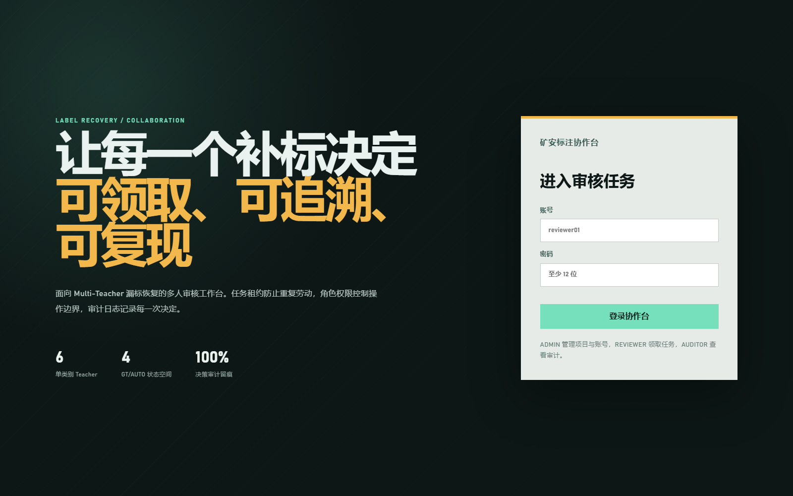
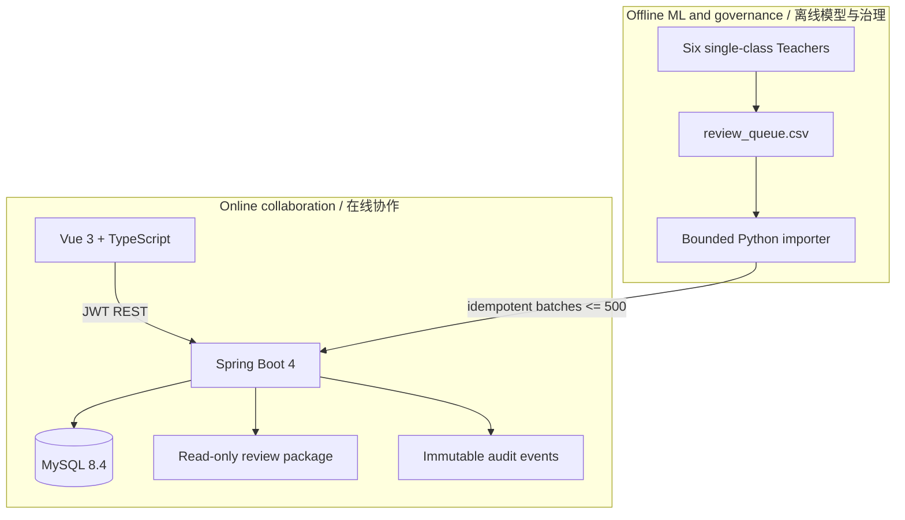
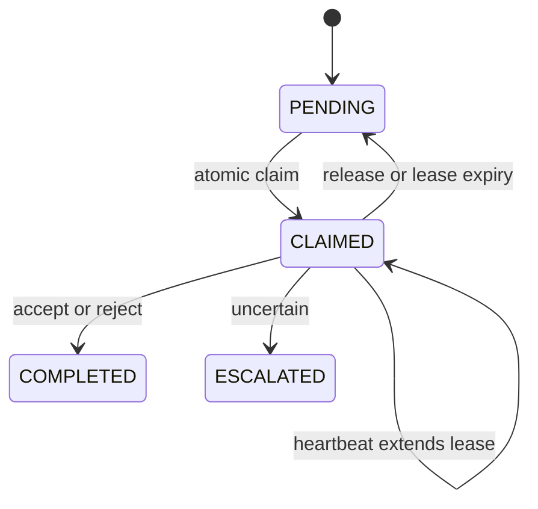

# Multi-user Review Collaboration Platform / 多人审核协作平台

## 1. Why this layer exists / 为什么增加这一层

The original Tk reviewer remains the best zero-dependency choice for one reviewer or offline delivery. A team workflow introduces different failure modes: two people may receive the same candidate, a browser may submit a stale decision, reviewers may see another project's data, and a final CSV may not explain who made each choice. The collaboration layer solves those coordination problems without replacing the Python inference and data-governance pipeline.

原有 Tk 审核器仍适合单人、离线和拷贝即用场景。多人并行后会新增四类风险：重复领取、旧页面覆盖、跨项目越权和责任不可追溯。Web 协作层只负责账号、任务与决策，不取代 Python 推理、GT/AUTO 枚举和最终派生数据集生成。

## 2. Running interface / 真实运行界面


<p>
  
  
</p>


The screenshots above were captured from the actual Vue and Spring Boot services against a real, user-approved review package. They demonstrate the real login flow, project progress, atomic task claim, read-only review visual delivery, constrained decisions, account creation and member assignment. They are not UI mockups and do not represent model-accuracy evidence.

以上截图由真实运行的 Vue 与 Spring Boot 服务生成，并加载了经许可使用的真实审核包。截图覆盖登录、项目进度、原子领取任务、只读审核图加载、受约束决策、账号创建和成员分配，不是界面示意图，也不作为模型精度证据。

## 3. Architecture / 架构



| Layer | Technology | Responsibility |
|---|---|---|
| ML and queue | Python 3.10+ | Teacher inference, GT/AUTO reasoning, visual rendering, CSV export |
| Web client | Vue 3, TypeScript, Vite | Login, project progress, real-image review, heartbeat, constrained decisions |
| API | Java 21, Spring Boot 4, Spring Security | Authentication, authorization, leasing, decisions, audit and visual access |
| Persistence | MySQL 8.4, JPA, Flyway | Users, projects, memberships, tasks, decisions, schema migrations |
| Delivery | Docker Compose or Windows JAR | Containerized three-service deployment, or a trusted-LAN host with optional VM-hosted MySQL |

## 4. Authorization model / 权限模型

Authentication and authorization are separate.

1. The password is stored with Spring Security's adaptive `DelegatingPasswordEncoder`; the API never stores plaintext passwords.
2. Login issues a short-lived HMAC-SHA256 JWT containing user ID, display name and role.
3. Global RBAC controls capability: `ADMIN` manages users/projects, `REVIEWER` decides tasks, and `AUDITOR` reads progress/audit.
4. Project membership controls scope. A non-admin sees, claims and opens visuals only for assigned projects.
5. The visual endpoint normalizes the requested path and rejects path traversal outside the configured read-only review root.

权限采用两层模型：角色决定“能做什么”，项目成员关系决定“能在哪个项目做”。即使知道任务 ID，未加入项目的账号也无法读取审核图。

## 5. Concurrency and correctness / 并发与正确性

### Atomic claim / 原子领取

`claim-next` runs in one database transaction. The repository uses `PESSIMISTIC_WRITE` (`SELECT ... FOR UPDATE`) to lock the first pending or expired task. A concurrent reviewer must wait and then receives a different row or `204 No Content`.

### Renewable lease / 可续租任务

A claim is not permanent. It records `claimed_by` and `lease_until`; the browser sends a heartbeat every 30 seconds and renders the remaining lease, renewal state and browser network state. Closing the browser stops renewal, so the task becomes claimable after the configured lease period. A reviewer must release or finish the active task before switching projects.

### One-click throughput and audited correction / 一键审核与审计式纠错

The high-frequency path intentionally uses one-click decisions: a valid action is persisted immediately, then the client claims the next pending candidate in the same image or advances to the next image. Reviewers do not pay a second confirmation click for every box. Completed decisions remain recoverable through a reviewer-scoped recent list. The original reviewer or an administrator may reopen and revise them with the current optimistic version, and every revision produces an audit event.

高频主流程采用“一键决定并自动前进”：合法动作立即写入服务端，优先进入本图下一框，本图完成后进入下一图，不为每个框增加二次确认成本。已完成决定仍可通过“我的最近审核”找回；原审核人或管理员使用最新乐观版本进行改判，并为每次修订生成审计事件。

### Optimistic version / 乐观版本

Every task carries JPA `@Version`. The client submits `expectedVersion` with a decision. If another transaction changed the task, the API returns `409 Conflict` instead of silently overwriting newer state.

### Idempotent import and one decision / 幂等导入与唯一决定

`(project_id, candidate_id)` is unique, so importing the same queue again safely skips existing candidates. `review_decisions.task_id` is also unique, so one task cannot obtain two final decisions even if a client retries.

### Validated concurrent workflow / 已验证的并发流程

The platform was exercised on a trusted campus LAN with two independent accounts reviewing at the same time. The production-shaped project contained `30,183` candidates. A previous desktop review file containing `4,465` decisions was migrated after task import; at migration time this became `4,464` completed tasks and `1` escalated task. Re-running the migration skipped existing decisions instead of duplicating them.

平台已在可信校园网中用两个独立账号同时领取和审核任务。真实规模项目包含 `30,183` 条候选；桌面端已完成的 `4,465` 条历史决定在任务导入后迁移为 `4,464` 条完成和 `1` 条疑难升级。重复迁移时已存在决定会被跳过，不会生成重复结果。

This test verified atomic allocation, lease ownership, historical migration, real-image access and audit attribution. It did not attempt to establish a maximum concurrent-user capacity.

本轮验证覆盖了原子分配、租约归属、历史迁移、真实图片读取和审核人追溯，但没有把双账号试用夸大为最大并发能力测试。

## 6. State and data model / 状态与数据模型



Core tables are `app_users`, `review_projects`, `project_members`, `review_tasks`, `review_decisions` and `audit_events`. Flyway owns schema evolution; Hibernate validates rather than mutates the production schema.

## 7. Run with Docker Compose / Docker 一键运行

```powershell
cd platform
Copy-Item .env.example .env
```

Edit `.env` and set strong database/admin passwords, a random JWT secret, and the absolute host path of the review package. Generate a JWT key with `openssl rand -base64 32` or an equivalent cryptographic random generator.

```powershell
docker compose up -d --build
```

Open `http://localhost:8088`. The bootstrap admin is created only when the configured username does not already exist.

## 8. Import an existing queue / 导入现有审核队列

The queue must contain `candidate_id`, `split`, `image_name`, `class_name`, `conf`, `case_code`, `recommended_action` and `visual_file`. `visual_file` must be relative to the mounted review package root.

```powershell
python platform\tools\import_review_queue.py `
  D:\review_package\review_queue.csv `
  --decisions D:\review_package\company_decisions.csv `
  --base-url http://localhost:8088 `
  --username admin `
  --password "your-admin-password" `
  --project-name "2026-08 six-class review" `
  --review-root /review-data
```

The importer reads one CSV row at a time and uploads at most 500 rows per request. It does not load the full queue or all images into memory. After tasks exist, `--decisions` migrates historical desktop outcomes in bounded batches. Both phases are idempotent: candidate IDs and existing decisions are skipped safely on retries.

导入器逐行读取 CSV，每次最多上传 500 条，不会把完整队列或全部图片装入内存。任务建立后，`--decisions` 会继续按有界批次迁移桌面审核结果。两个阶段都支持安全重试，已存在的候选和决定会被幂等跳过。

After creating reviewer accounts in the admin drawer, assign each username to the selected project. Reviewers then see only their assigned projects.

## 9. Local development / 本地开发

```powershell
# Backend
cd platform\backend
mvn test
mvn spring-boot:run

# Frontend, in another terminal
cd platform\frontend
npm install
npm run dev
```

The Vite development server proxies `/api` to `localhost:8080`. Tests use H2 in MySQL compatibility mode; production uses MySQL and Flyway.

### Trusted LAN deployment / 可信局域网部署

For a small team on the same trusted network, the platform can run directly on a Windows host while MySQL runs locally, in VMware, or on another LAN server. The scripts check database reachability, optionally start the VM without a visible window, launch the JAR, poll the health endpoint and expose only a configurable URL and subnet.

同一可信局域网内的小团队可以直接使用 Windows 主机部署，MySQL 可运行在本机、VMware 或局域网数据库服务器。配套脚本会检查数据库、按需无界面启动虚拟机、启动 JAR、轮询健康状态，并通过本机忽略配置指定访问地址和允许网段。

See [campus-deploy/README.md](../platform/campus-deploy/README.md). Local passwords, database addresses, VM paths, logs and PID files are Git-ignored.

## 10. API surface / 主要接口

| Method | Path | Meaning |
|---|---|---|
| POST | `/api/auth/login` | Authenticate and issue JWT |
| GET | `/api/projects` | List visible projects |
| POST | `/api/projects/{id}/members` | Assign a project member, admin only |
| POST | `/api/projects/{id}/tasks:batch` | Idempotent task import, admin only |
| POST | `/api/projects/{id}/decisions:history` | Idempotent historical-decision migration, admin only |
| POST | `/api/tasks/claim-next?projectId={id}` | Atomically lease one task |
| POST | `/api/tasks/{id}/heartbeat` | Renew current user's lease |
| POST | `/api/tasks/{id}/decision` | Submit constrained decision and expected version |
| PUT | `/api/tasks/{id}/decision` | Revise an owned/admin decision with expected version |
| GET | `/api/tasks/recent?projectId={id}` | Current reviewer's recent decisions in one project |
| GET | `/api/tasks/{id}/image-candidates` | All candidate boxes grouped by source image |
| GET | `/api/tasks/{id}/visual` | Read an authorized real review image |
| GET | `/api/projects/{id}/audit` | Read project audit trail, admin/auditor |

## 11. Reproduce documentation screenshots / 重建文档截图

The screenshot tool uses Chrome DevTools directly and adds no browser-automation dependency to the application. Credentials are supplied only through process environment variables; the script waits for animations and images, captures login/dashboard/admin/review/productivity states, and releases the temporary claimed task.

截图脚本直接调用 Chrome DevTools，不给业务项目增加浏览器自动化依赖。账号密码只通过当前进程环境变量传入；脚本会等待动画和图片稳定，拍摄四个页面，并释放临时领取的任务。

```powershell
$env:LABEL_REVIEW_CAPTURE_USERNAME = "admin"
$env:LABEL_REVIEW_CAPTURE_PASSWORD = "<admin-password>"
$env:LABEL_REVIEW_CAPTURE_URL = "http://127.0.0.1:8088"
node platform\tools\capture_platform_screenshots.mjs docs\assets
```

## 12. Interview walkthrough / 面试讲解顺序

1. Start from the data problem: incomplete labels make true objects become false background supervision.
2. Explain why offline inference and online review are separated: GPU jobs are expensive and bursty; human review is concurrent and stateful.
3. Draw the claim transaction and lease timeline; emphasize pessimistic locking for allocation, visible heartbeat recovery and optimistic locking for stale clients.
4. Explain dual authorization: RBAC handles capability while project membership handles data scope.
5. Show bounded idempotent import and read-only visual mounts as memory-safety and data-safety decisions.
6. Close with evidence: `30,183` imported candidates, `4,465` migrated decisions, two-account concurrent validation, real screenshots, automated Java/Python tests and two reproducible deployment modes.

## 13. Production hardening / 生产加固

### Query-path indexes / 查询路径索引

Flyway `V2__review_productivity_indexes.sql` adds indexes that match user-visible access paths: `(project_id, split, image_name, id)` supports the image-grouped left rail, while `(reviewer_id, decided_at, id)` supports deterministic newest-first recent decisions. The migration has been validated against MySQL 8.4; Hibernate validates the resulting schema instead of mutating it at runtime.

索引来自真实交互路径：按图聚合列表需要快速定位同项目、同划分、同图片的候选；最近审核需要按审核人和决定时间倒序读取。迁移由 Flyway 版本化执行，生产环境不依赖 Hibernate 自动改表。

Before exposing the service beyond a trusted LAN, terminate TLS at a reverse proxy, rotate JWT/database secrets, disable bootstrap admin after first setup, back up MySQL, centralize logs and metrics, and define account disable/password-reset procedures. Docker Compose is an auditable single-host baseline; Kubernetes or managed databases are deployment choices, not prerequisites for the core workflow.
