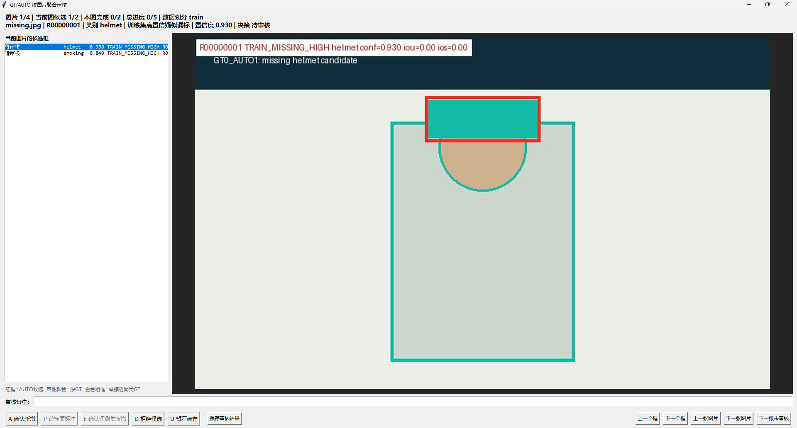

# Image-Grouped Review Application / 按图片聚合审核平台

[English](#english) | [简体中文](#简体中文)



## English

### Purpose

The desktop reviewer is the human safety boundary between Teacher evidence and trainable labels. It is intentionally model-free: reviewers only need Python, Tk and Pillow, while expensive inference can remain on a remote GPU machine.

The application solves four operational problems that are easy to miss in a candidate-by-candidate script:

1. All candidates from one image are reviewed together, preserving joint-scene and overlap context.
2. The decision engine controls which actions are legal for each candidate.
3. Every decision is recoverable after a crash or power loss.
4. A review folder can be copied to an offline workstation without the source dataset or model weights.

### Review-package contract

`review-build` produces a portable directory:

```text
review/
|-- company_decisions_template.csv   # immutable queue template
|-- company_decisions.csv            # periodically checkpointed decisions
|-- company_decisions_progress.jsonl # append-only decision journal
|-- review_queue.csv                  # candidates requiring human judgment
|-- review_gui.py                     # standalone desktop application
|-- START_REVIEW.bat                  # Chinese launcher
|-- START_REVIEW_EN.bat               # English launcher
|-- REVIEW_GUIDE_CN.txt
`-- visuals/                          # pre-rendered GT/AUTO evidence
```

The minimum queue schema is:

| Field | Meaning |
|---|---|
| `candidate_id` | Stable identity used for journal replay |
| `split`, `image`, `image_name` | Image grouping and dataset context |
| `class_name`, `conf` | Teacher class and confidence evidence |
| `case_code` | Decision-engine classification |
| `recommended_action` | Legal action family for the candidate |
| `visual_file` | Pre-rendered evidence relative to the review root |

### Interaction model

- `A`: accept a missing training annotation.
- `P`: replace the highlighted same-class GT when the extent is wrong.
- `E`: accept evidence for evaluation-set curation without automatically changing evaluation labels.
- `D`: reject the candidate.
- `U`: mark uncertain for escalation.
- Left/right arrows switch candidates in the current image.
- Up/down arrows switch images.

Actions that do not match `recommended_action` are disabled. This prevents an operator from accidentally applying a replacement to a pure missing-label case or writing a validation/test candidate into training labels.

### Crash-safe persistence

Each decision follows a two-level persistence protocol:

1. Append one UTF-8 JSON object to `company_decisions_progress.jsonl`, flush it and call `fsync`.
2. Every configurable checkpoint interval, write the full CSV to a temporary file, flush and `fsync`, then atomically replace `company_decisions.csv`.

On restart, the reviewer loads the latest CSV and replays valid journal events by `candidate_id`. A partially written final JSONL line is ignored, so one interrupted write cannot invalidate earlier work.

### Queue ordering

The default order is deterministic:

1. `train` before `val` and `test`.
2. High-confidence omissions before medium-confidence and ambiguous cases.
3. Rare operational classes before common `person` candidates.
4. Stable image-name ordering as the final tie breaker.

This ordering does not alter evidence or decisions. It only brings high-value and rare-class work forward when a large review cannot be completed in one sitting.

### Run the public no-GPU demo

```powershell
python examples\create_review_fixture.py --output-dir .demo-grouped-review --force
yolo-label-recovery review-build `
  .demo-grouped-review\dataset `
  .demo-grouped-review\candidates.csv `
  --policy configs\review_policy.example.yaml `
  --output-dir .demo-grouped-review\review `
  --render `
  --force

.\.demo-grouped-review\review\START_REVIEW.bat
```

The fixture contains all four GT/AUTO states and a source image with both `helmet` and `smoking` candidates. No CUDA, PyTorch, Ultralytics or model weights are required.

## 简体中文

### 设计目标

桌面审核器是 Teacher 预测证据和可训练标签之间的人工安全边界。它刻意不依赖模型推理：5090 等 GPU 机器只负责生成审核包，公司审核电脑只需 Python、Tk 和 Pillow 即可离线工作。

平台重点解决四个工程问题：

1. 同一原图上的候选框一起审核，保留联合场景和框重叠上下文。
2. 由决策引擎约束每个候选允许执行的动作，避免误操作。
3. 断电、程序异常或系统重启后，已完成决策可恢复。
4. 审核包可独立拷贝，不需要携带训练数据集和模型权重。

### 审核包结构

`review-build` 会生成一个可直接交付的目录：

```text
review/
|-- company_decisions_template.csv   # 不变的审核队列模板
|-- company_decisions.csv            # 定期原子保存的审核结果
|-- company_decisions_progress.jsonl # 逐次追加的决策日志
|-- review_queue.csv                  # 需要人工判断的候选
|-- review_gui.py                     # 可独立运行的桌面程序
|-- START_REVIEW.bat                  # 中文启动器
|-- START_REVIEW_EN.bat               # 英文启动器
|-- REVIEW_GUIDE_CN.txt
`-- visuals/                          # 预渲染 GT/AUTO 证据图
```

### 审核动作

- `A`：确认补充训练集漏标。
- `P`：用 AUTO 框替换高亮的同类 GT。
- `E`：确认评测集证据，但不直接污染评测标签。
- `D`：拒绝候选。
- `U`：暂不确定，交给更高等级人员复核。
- 左右方向键：切换当前图片内的候选框。
- 上下方向键：切换图片。

界面会根据 `recommended_action` 自动禁用不合法按钮。例如，纯漏标场景不能执行“替换 GT”，val/test 候选也不能误走训练集自动补标动作。

### 断点续审原理

每次决策使用两级持久化：

1. 先向 `company_decisions_progress.jsonl` 追加一条 UTF-8 JSON 记录，随后执行 `flush + fsync`。
2. 达到检查点间隔后，将完整 CSV 写入临时文件，执行 `flush + fsync`，最后通过原子替换更新 `company_decisions.csv`。

重新启动时，程序先读取最新 CSV，再按照 `candidate_id` 重放有效 JSONL 事件。若异常退出导致日志最后一行只写了一半，该行会被忽略，不影响此前已经落盘的审核结果。

### 生产验证

该工作流已在 `29,071` 张六分类图片上运行。六个单类别 Teacher 完成 `174,426` 次图片-模型扫描，形成 `99,696` 条预测证据和 `30,183` 条人工审核项；按原图聚合后为 `13,639` 张待审图片，可视化失败为 `0`，源标签始终保持不变。

这组结果说明平台不仅能处理演示数据，也覆盖了大规模审核队列的分组、恢复、导出和人工交接问题。
