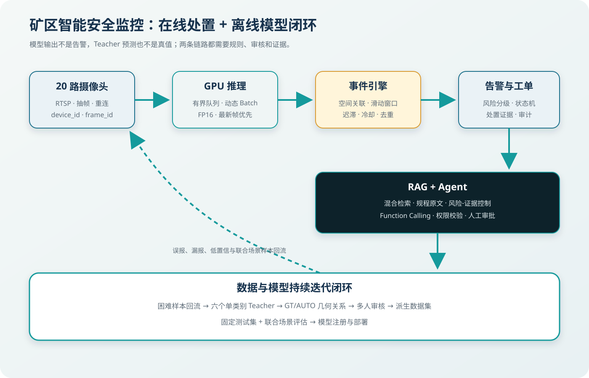
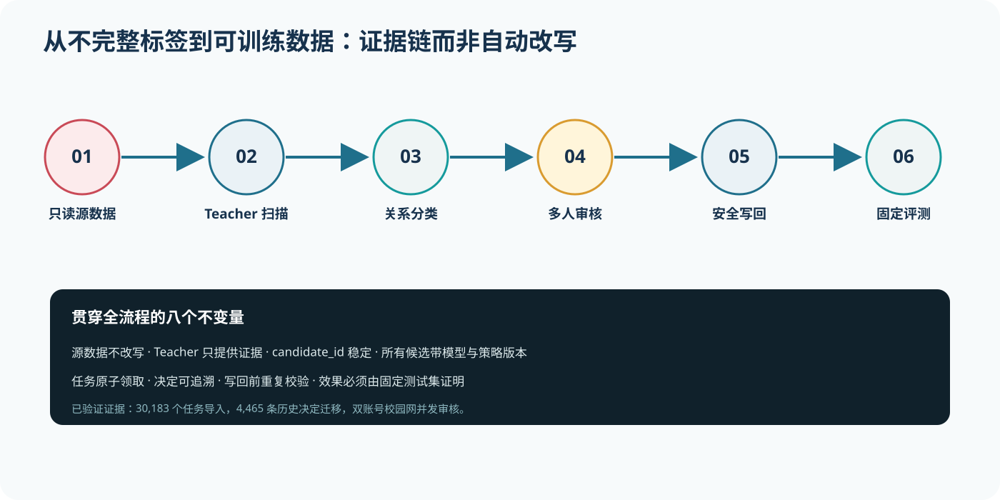
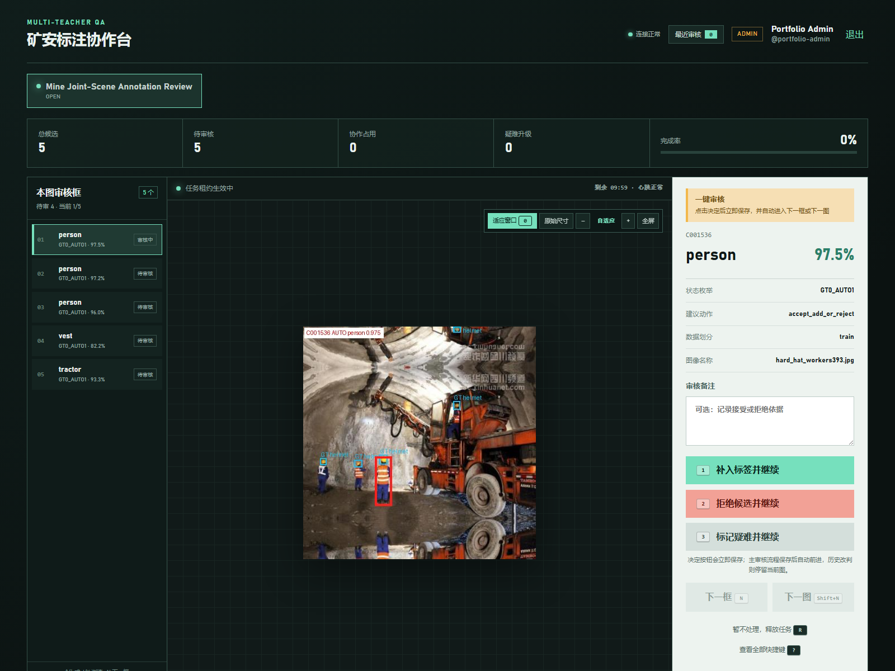
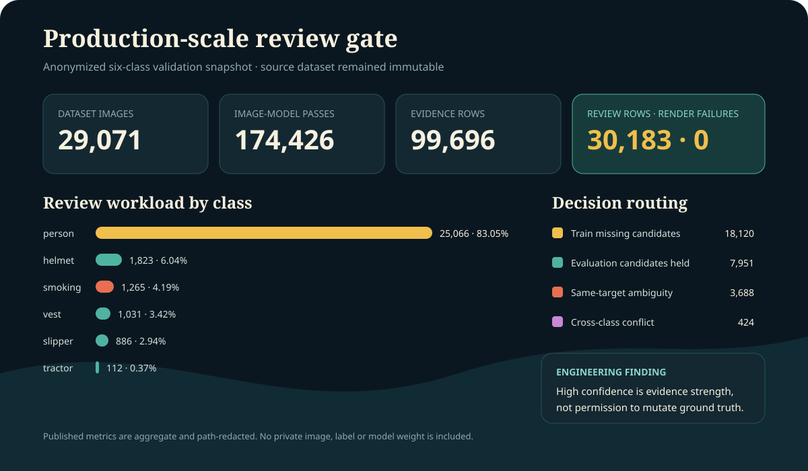

# 从漏标数据到矿区智能安全闭环：一个 YOLO 项目如何走向工程系统

> 这不是一篇“训练一次 YOLO 就结束”的记录。真正的问题是：多来源数据为什么会互相制造错误监督，六个模型如何稳定扫描全量数据，多人如何安全审核，以及检测结果怎样进入告警、工单、RAG 和 Agent。



## 1. 起点：指标问题不一定是模型问题

项目面向人员、安全帽、反光背心、工程车辆、拖鞋和吸烟六类目标。数据来自多个独立来源，而每个来源通常只标自己的关注类别：拖鞋数据可能只标拖鞋，吸烟数据只标手和烟，图片中真实存在的人员、安全帽和背心却没有标签。

这不是“少了一条标注”这么简单。目标检测训练会把未标注的真实目标当作背景，形成错误负监督。联合场景越多，监督冲突越严重，最终可能表现为：不戴安全帽时能检测吸烟，戴上安全帽后反而漏检；或者拖鞋单独出现能检出，与人员、安全帽同时出现时召回下降。

因此，第一步不是继续调学习率，而是确认数据、模型和部署链路各自承担了什么责任。

## 2. Multi-Teacher：模型提出证据，不修改真值

我们从完整六类数据中构建六个单类别训练集，并加入一定比例的其他类别图片作为负样本。六个专用 Teacher 分别扫描全量数据，降低多类别竞争，并允许对吸烟、拖鞋等弱势类别单独校准。



预测框不会凭置信度直接写入标签。系统先枚举 `GT0_AUTO0`、`GT1_AUTO0`、`GT0_AUTO1`、`GT1_AUTO1`，再联合判断：

- **IoU**：两个框整体重叠程度；
- **IoS**：小框被大框包含时比 IoU 更敏感；
- **归一化中心距离**：消除分辨率和目标尺寸差异；
- **面积比例**：区分同目标尺度差异和真正独立目标；
- **同类重复与跨类冲突**：避免把合理嵌套当成重复框。

这样才能区分“已经标过”“同一目标框大小不一致”“新的漏标目标”和“Teacher 自己的重复预测”。

## 3. 全量扫描为什么会爆显存和内存

六个模型扫描 N 张图片，本质上需要完成约 `6 × N` 次推理。我们接受总工作量，但把峰值资源控制住：

```text
一次只加载一个 Teacher
图片按批次流式读取
CUDA 使用 FP16
Windows workers=0 避免多进程复制
OOM 时 Batch 32 → 16 → 8 动态回退
每个已提交批次立即写 CSV 与断点状态
```

关键不是“把所有图片装入显存”。显存保存模型参数和当前 Batch 的张量；内存保存解码图片、预取数据和临时结构；磁盘保存原图、CSV、可视化和断点。把三层资源混为一谈，就很难定位 OOM。

自适应 Batch 也必须像小事务：失败批次不能留下半截 CSV、重复候选或错误断点。只有整个 Batch 成功后，状态才提交。

## 4. 从桌面审核到 Spring Boot + Vue 多人平台

单人使用 CSV 和桌面 GUI 可以工作，但多人同时修改 CSV 缺少事务、锁、权限和审计。因此我们把候选任务导入 MySQL，并开发了 Spring Boot + Vue 3 审核平台。


平台采用三种互补机制：

- **数据库行锁**：领取任务的短事务中保证同一任务不会被两人同时领取；
- **租约与心跳**：用户关闭页面或断网后，任务不会永久占用；
- **乐观版本**：旧页面提交时拒绝覆盖别人已经完成的决定。

角色权限之外还需要项目成员关系。一个账号能登录，不代表自动拥有所有项目的数据访问权。

## 5. 审核体验也是工程问题

最初的“选择决定 → 再确认 → 手动下一条”看起来更安全，但每条任务增加两次操作，审核量一大就严重拖慢效率。最终工作台采用一键提交、自动前进，并以“最近审核可修订”补偿误操作。



该工作台在同一真实地下场景中聚合展示五个候选框，并完整呈现租约、决策区、快捷键和释放任务入口。

同一图片的候选框在左侧聚合显示，审核员可以在联合场景中判断 person、helmet、smoking 是否属于合理嵌套，而不是在割裂的截图里逐框猜测。图片支持适应窗口、原始尺寸和缩放，但默认不铺满整个画布，避免工具栏和上下文被挤出屏幕。

## 6. 安全写回：接受也不等于直接 append

审核完成后，系统仍然不会修改源数据。写回阶段会：

1. 检查是否存在未完成或 `UNCERTAIN` 决定；
2. 复制或硬链接形成派生数据集；
3. 校验类别、归一化坐标和目标标签路径；
4. 对新增框重新做同类重复检查；
5. 对替换操作确认源 GT 没有在审核后发生漂移；
6. 输出应用日志与新数据版本。

源数据只读、派生数据可回滚，是整个流程最重要的不变量之一。

## 7. 已有运行证据

当前协作链路已经完成：

- `30,183` 个候选任务导入平台；
- `4,465` 条历史桌面审核决定幂等迁移；
- 两个独立账号在校园网内同时领取和审核；
- 真实图片、租约心跳、最近决定修订和按图聚合均完成联调。



这些证据证明工作流可运行，但不能直接证明新版模型指标一定提升。模型收益仍需使用固定 test、分类别 Precision/Recall/mAP，以及安全帽+吸烟、人员+拖鞋等联合场景专项集验证。

## 8. 放回在线矿区监控系统

20 路 RTSP 不能按“逐帧同步推理”实现。推荐每路独立拉流，只保留最新待处理帧，经共享有界队列进入单 GPU 模型实例，并使用动态 Batch 提高吞吐。队列满载时主动丢弃旧帧，而不是让用户看到几分钟前的“实时视频”。

每个结果都必须携带 `device_id + frame_id + captured_at`。如果前端没有对应帧缓存，就不能把旧坐标画到当前画面；最稳妥的方式是后端在完成检测的同一帧上画框，再推送标注流。

吸烟和拖鞋不能单帧即告警。更合理的事件链是：

```text
局部框与 person 轨迹做空间关联
→ 20 秒窗口内多次有效命中
→ 严格进入、宽松维持、长时间无命中退出
→ 冷却时间与唯一键去重
→ 形成告警和工单
```

因此，模型 mAP、单帧延迟、事件召回率和端到端告警延迟是四类不同指标。

## 9. RAG：没有证据就不要给高风险指令

规程文档入库前需要哈希去重、OCR、标题恢复和条款级切片，并保留版本、章节、条款号和页码。检索采用向量召回与 BM25 关键词召回，再用 RRF 融合和 Cross-Encoder 重排序。

高风险答案必须关联有效规程原文；证据不足时，系统返回“需要人工确认”，而不是让大模型补全看似合理的处置步骤。答案同时返回规程名称、章节、页码和原文片段，支持追溯。

## 10. Agent：大模型负责理解，业务代码负责执行

Agent 不能直接写数据库。模型只能调用后端暴露的受控工具，例如查询规程、读取设备、创建工单和升级告警。Spring Boot 仍负责 JWT、RBAC、状态机、参数校验、事务与审计。

所有有副作用的工具调用携带幂等键。高风险动作进入人工审批状态，网络超时后先查询执行结果，不能盲目再次创建工单。RAG 文档、设备名称和用户输入都视为不可信数据，不能改变工具白名单。

## 11. 为什么没有一开始就上 Redis、Kafka 和微服务

当前规模下，模块化单体和 MySQL 更容易保证事务一致性。演进顺序应该由瓶颈驱动：

```text
模块化单体 + MySQL
→ 独立 GPU 推理服务 + 对象存储
→ Redis 承载心跳、事件窗口和热点状态
→ Kafka 解耦告警通知、统计和困难样本回流
→ 按扩容与团队边界拆分微服务
```

引入 Kafka 时需要 Transactional Outbox 和消费者幂等，不能简单“双写数据库和消息队列”。技术栈越多不代表系统越成熟，能解释为什么暂时不用同样是一种工程能力。

## 12. 面试时怎么讲

30 秒版本：

> 我负责矿区视觉模型的数据治理和多人审核平台。针对多来源六类 YOLO 数据中的联合场景漏标，我训练六个单类别 Teacher 全量扫描，用 IoU、IoS、中心距离和面积比例识别疑似漏标，再通过 Spring Boot、MySQL、Vue 多人平台安全审核与回写，形成可追溯的数据闭环。

不要夸大的边界：

- 当前可以说完成多人协作和双账号验证，不能直接说“高并发生产平台”；
- Redis、Kafka、Kubernetes 是演进方案，不是当前已落地技术；
- 单帧推理延迟不等于 20 路端到端延迟；
- mAP 不等于事件级告警准确率；
- 补标完成不等于模型一定提升，最终仍由固定测试集证明。

## 结语

这个项目真正有价值的地方，不是把模型预测自动写成标签，而是建立了清晰的权力边界：模型提供证据，规则解释关系，人工授权变化，数据库维护协作一致性，派生数据集保证可回滚，固定评测决定模型是否值得部署。

当一套视觉模型具备数据回流、可追溯审核、可靠告警和证据约束后，它才从一次训练实验，走向可以长期迭代的工程系统。
