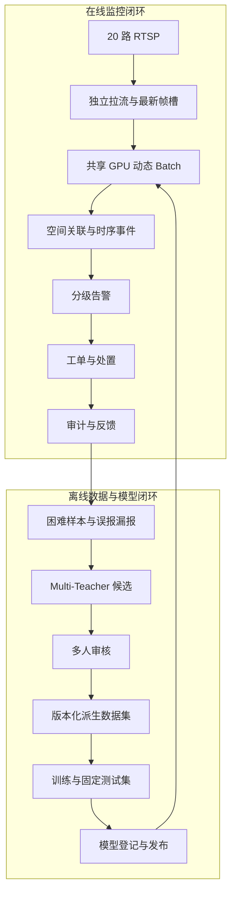

# 智能矿区安全监控系统设计

YOLO Label Recovery 是完整矿区系统的离线数据与模型治理子系统。完整系统需要同时处理在线监控闭环和离线模型闭环，并用统一的设备、模型、事件、证据和版本标识连接两条链路。

## 1. 双闭环架构



在线链路追求低延迟、可降级和事件可靠性；离线链路追求可追溯、可回滚和评测可信度。把两者塞进同一个同步请求，会让视频抖动、GPU 阻塞和数据库事务相互放大。

## 2. 在线视频与推理

每路摄像头维护独立解码循环，只保留最新待处理帧。共享调度器从各通道公平取帧，达到 batch 数量或最大等待时间后立即推理。队列必须有界，满载时优先丢弃旧帧，而不是让历史帧排队制造“看起来流畅、实际上晚几秒”的假实时。

每条推理结果必须带：`device_id`、`channel_id`、`frame_id`、`captured_at`、`inferred_at`、`model_version` 和原始框。前端框与视频必须使用同一帧：要么后端在原帧上画框后推流，要么前端按 `frame_id/timestamp` 从短帧缓存中对齐，不能把几秒前的坐标画到当前画面。

## 3. 从框到事件

单帧检测不是业务告警。以吸烟为例：

```text
检测框 -> 与人员轨迹和手口区域关联
      -> 20 秒滑动窗口累计命中
      -> 进入/维持/退出迟滞规则
      -> 形成一个 smoking event
      -> 告警去重、分级和工单派发
```

推荐使用事件键 `device + class + track_id + time_bucket` 防止重复告警。事件关闭前的连续框属于同一事件；模型短暂漏检不应立即关闭，长时间无命中才退出。

## 4. Spring Boot 业务主干

在业务稳定前采用模块化单体：

| 模块 | 核心职责 | 关键约束 |
|---|---|---|
| auth | 用户、角色和项目/区域权限 | RBAC + 资源范围授权 |
| device | 摄像头、区域、流地址和状态 | RTSP 密钥不向前端明文暴露 |
| detection | 接收模型结果和证据索引 | 每条结果可追溯到模型和帧 |
| alert | 规则、事件聚合和告警状态 | 单帧框不能直接落告警 |
| workorder | 派发、接受、处置、升级和关闭 | 状态机 + 幂等 + 审计 |
| knowledge | 规程版本、切片、检索和引用 | 高风险回答必须有有效证据 |
| agent | 工具编排和人工审批 | Prompt 不是权限边界 |

GPU 推理和视频解码因资源模型不同，适合作为首批独立服务；设备、告警、工单先保留本地事务，避免过早拆分导致分布式一致性成本。

## 5. RAG 与 Agent

RAG 入库需要文档哈希、OCR、标题层级、条款号、页码、生效状态和版本。检索使用向量召回 + BM25 精确召回，再通过 RRF 融合和重排序。回答返回原文片段和定位，高风险问题证据不足时拒答并转人工。

Agent 只能调用固定工具，如 `query_safety_knowledge`、`get_device_info`、`create_work_order` 和 `escalate_alert`。所有工具参数由服务端校验；有副作用的调用携带幂等键；高风险动作经过状态机和人工审批。大模型负责理解和规划，代码负责权限、事务和安全。

## 6. Redis、Kafka 与微服务何时引入

- MySQL 先承载需要强一致的用户、设备、告警、工单和审核事实。
- Redis 在高频设备心跳、滑动窗口和热点状态成为瓶颈时引入。
- Kafka 在告警需要通知、统计、归档和样本回流等多个异步下游时引入。
- 数据库与消息使用 Transactional Outbox，消费者按 event_id 幂等。
- 只有当资源扩缩容、发布频率或团队边界真正分化时再拆微服务。

## 7. 监控与验收

模型延迟和端到端延迟分开：

- `capture_to_queue_ms`
- `queue_wait_ms`
- `inference_ms`
- `event_decision_ms`
- `capture_to_display_ms`

还要监控每路实际推理 FPS、帧龄、丢帧率、队列长度、断流次数、告警去重率、工单闭环时间、RAG 引用正确率和 Agent 人工升级率。

## 8. 当前仓库边界

当前公开仓库已实现并验证的是 Python 数据治理、Multi-Teacher 候选、桌面/Web 审核、MySQL 协作控制和安全写回。多路 RTSP、RAG、Agent、Redis/Kafka 和边缘推理在本文件中属于完整系统设计，必须根据后续实际代码与测试逐项升级为“已实现”。
