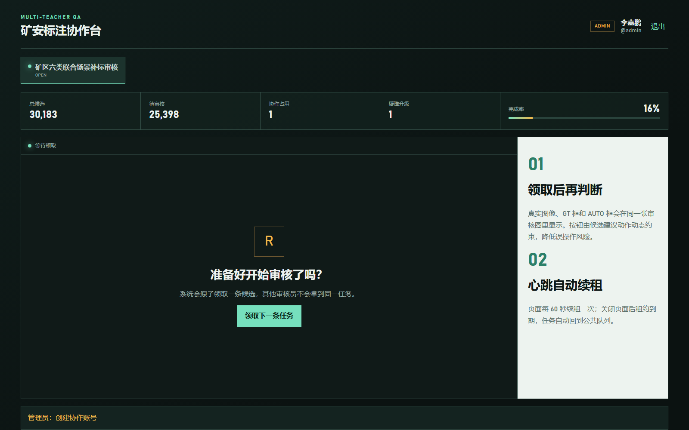
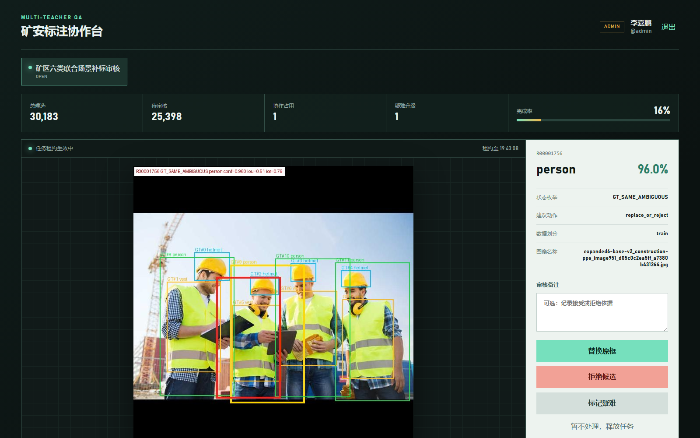
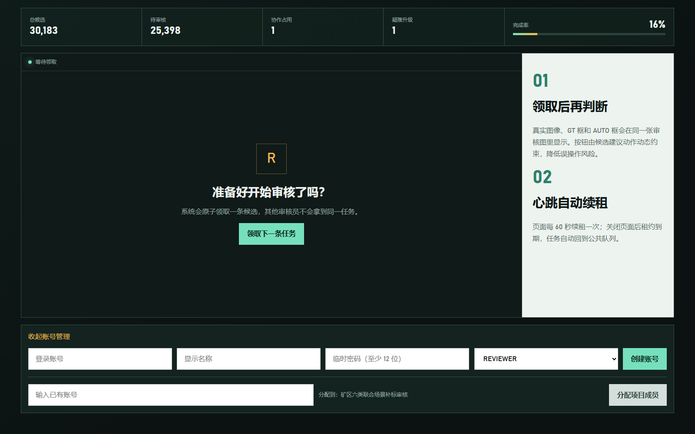

# Label Review Collaboration Platform / 多人审核协作平台

[中文主说明](../docs/COLLABORATION_PLATFORM.md) | [Project README](../README.md)

This directory turns the offline review queue into a multi-user, auditable web workflow. It has been validated with two independent reviewer accounts on a trusted LAN.

本目录把离线审核队列转换为多人可登录、可追溯的 Web 审核流程，并已在可信局域网中用两个独立账号完成同时审核验证。



<p>
  
  
</p>

## Components / 目录

- `backend/`: Spring Boot 4 REST API, JWT/RBAC, project membership, task leasing, audit and Flyway.
- `frontend/`: Vue 3 + TypeScript review workspace with heartbeat and constrained Chinese decisions.
- `tools/import_review_queue.py`: bounded, idempotent bridge for queues and historical desktop decisions.
- `tools/capture_platform_screenshots.mjs`: dependency-free Chrome DevTools documentation capture.
- `docker-compose.yml`: MySQL, API and Nginx-hosted frontend.
- `campus-deploy/`: Windows and trusted-LAN deployment scripts with Git-ignored local configuration.

## Docker deployment / Docker 部署


The image above is a capture of the running application with a real review visual and seeded collaboration records, not a mockup. Additional login and administration screenshots are available in [COLLABORATION_PLATFORM.md](../docs/COLLABORATION_PLATFORM.md).

```powershell
cd platform
Copy-Item .env.example .env
# Edit passwords, JWT secret and REVIEW_PACKAGE_DIR.
docker compose up -d --build
```

Then open `http://localhost:8088`. Full architecture, deployment and API documentation is in [COLLABORATION_PLATFORM.md](../docs/COLLABORATION_PLATFORM.md).

## Trusted LAN deployment / 校园网或局域网部署

Build the frontend and JAR, create the ignored `campus-deploy/campus.local.env`, then use the start/status/stop scripts. MySQL may run on the host, in VMware or on another LAN machine.

构建前端和 JAR 后，在 `campus-deploy/campus.local.env` 中填写仅本机使用的配置，再通过启动、状态和停止脚本管理平台。详细步骤见 [campus-deploy/README.md](campus-deploy/README.md)。

Production-scale validation imported `30,183` tasks and migrated `4,465` historical decisions. These figures validate workflow scale and migration behavior, not detector accuracy or maximum concurrency.
