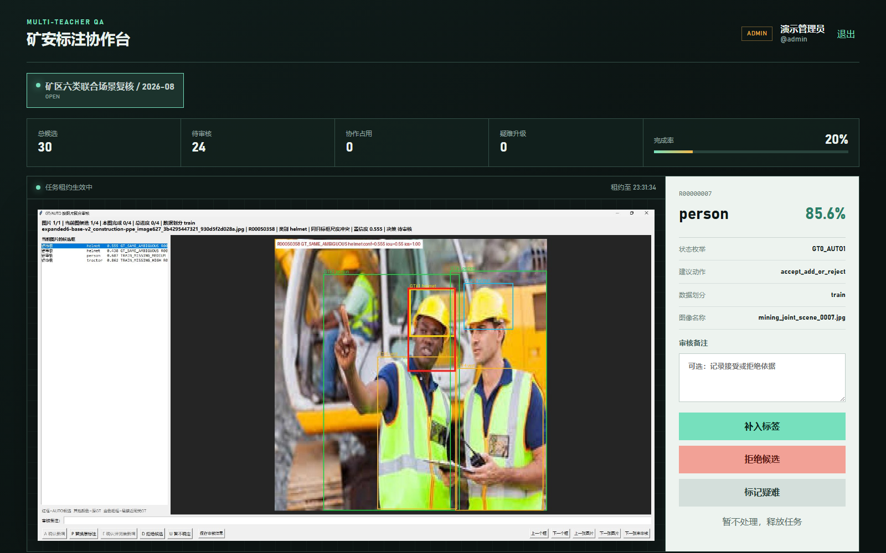

# Label Review Collaboration Platform

[中文主说明](../docs/COLLABORATION_PLATFORM.md) | [Project README](../README.md)

This directory turns the offline review queue into a multi-user web workflow:

- `backend/`: Spring Boot 4 REST API, JWT/RBAC, project membership, task leasing, audit and Flyway.
- `frontend/`: Vue 3 + TypeScript review workspace with heartbeat and constrained Chinese decisions.
- `tools/import_review_queue.py`: bounded, idempotent bridge from `review_queue.csv`.
- `docker-compose.yml`: MySQL, API and Nginx-hosted frontend.



The image above is a capture of the running application with a real review visual and seeded collaboration records, not a mockup. Additional login and administration screenshots are available in [COLLABORATION_PLATFORM.md](../docs/COLLABORATION_PLATFORM.md).

```powershell
cd platform
Copy-Item .env.example .env
# Edit passwords, JWT secret and REVIEW_PACKAGE_DIR.
docker compose up -d --build
```

Then open `http://localhost:8088`. Full architecture, deployment and API documentation is in [COLLABORATION_PLATFORM.md](../docs/COLLABORATION_PLATFORM.md).
